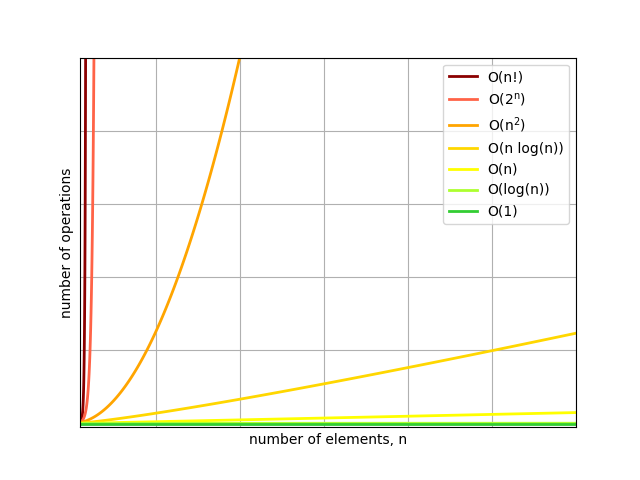

# Algorithms and Data structures 📚
This repository contains my steps in learning CS. To understand the basics, I code algorithms and data structures from scratch.

**Data structures**
- [ ] Array
- [ ] Linked list
- [ ] B-Tree

| Searching algorithms                        |     ⏱    |  💾  |
|:-------------------------------------------:|:---------:|:----:|
| [Binary search](searching/binary_search.py) | O(log(n)) | O(1) |

| Sorting algorithms                          |     ⏱           |  💾  |
|:-------------------------------------------:|:----------------:|:----:|
| [Insertion sort](sorting/insertion_sort.py) | O(n2) | O(1) |
| [Selection sort](sorting/selection_sort.py) | O(n2) | O(1) |
| [Bubble sort](sorting/bubble_sort.py)       | O(n2) | O(1) |
| [Counting sort](sorting/counting_sort.py)   |   |   |
| [Quicksort](sorting/quicksort.py)           |   |   |
| [Mergesort](sorting/mergesort.py)           |   |   |

Each algorithms has its runtime ⏱ and space 💾 complexity, here are the typical ones

